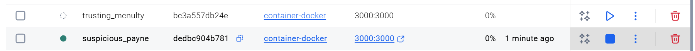
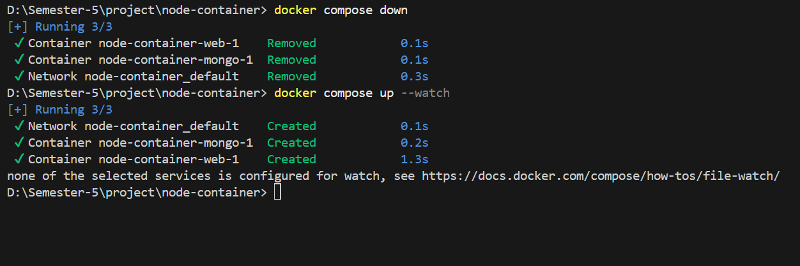
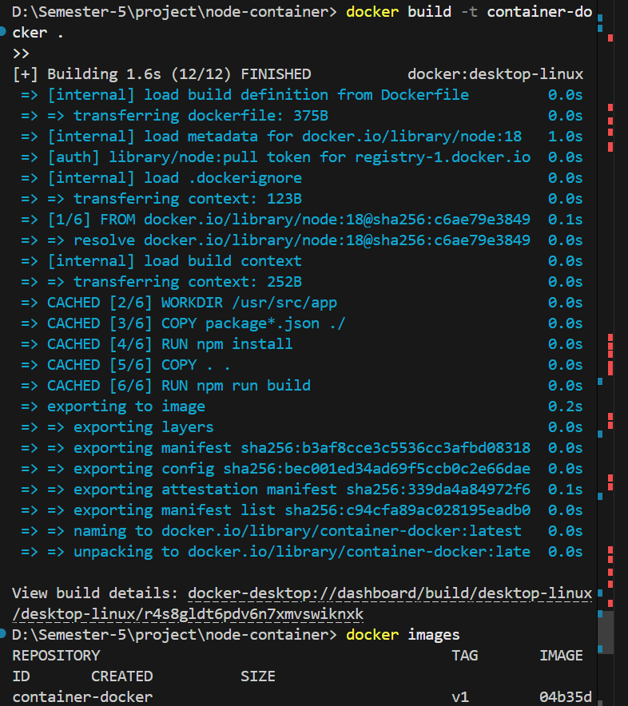
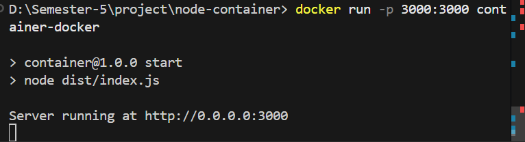
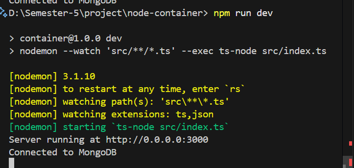
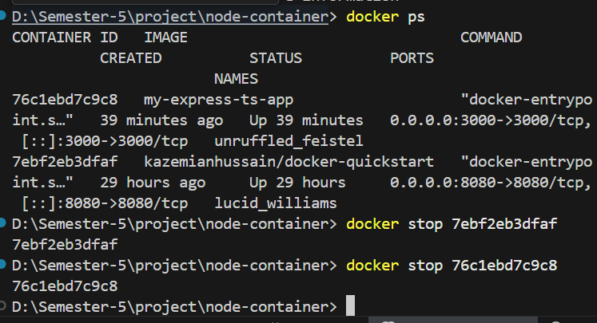

# Node-container tehtävä


## Run with docker compose
```bash
docker compose up --watch
```
,



## Build and Run Production Image

```bash
 docker build -t container-docker:v1 .
 ```
 
```bash
 docker run -p 3000:3000 name of an image
  ```




## Run locally
```bash
npm run dev
```



## Challenges
```bash
docker ps 
docker stop by ID 
```


