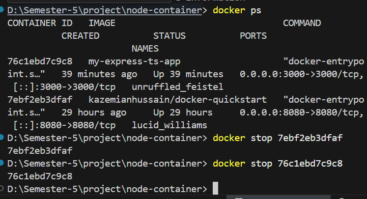

# Nde-container


## Run with docker compose
```bash
docker compose up --watch
```

## Build and Run Production Image

```bash
 docker build -t container-docker:v1 .
 docker run -p 3000:3000 name of an image

```

## Run locally
```bash
npm run dev
```

## Challemges
```bash
docker ps 
then docker stop by ID 


```